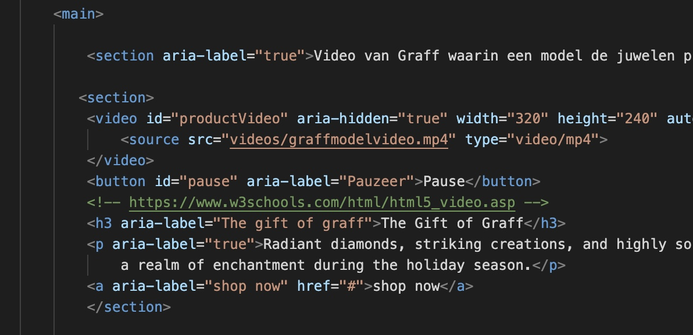

# Procesverslag
Markdown is een simpele manier om HTML te schrijven.  
Markdown cheat cheet: [Hulp bij het schrijven van Markdown](https://github.com/adam-p/markdown-here/wiki/Markdown-Cheatsheet).

Nb. De standaardstructuur en de spartaanse opmaak van de README.md zijn helemaal prima. Het gaat om de inhoud van je procesverslag. Besteedt de tijd voor pracht en praal aan je website.

Nb. Door *open* toe te voegen aan een *details* element kun je deze standaard open zetten. Fijn om dat steeds voor de relevante stuk(ken) te doen.

## Jij

  
uitwerken voor kick-off werkgroep

  ### Auteur:
  Tess Kortekaas

  #### Je startniveau:
  Blauw

  #### Je focus:
  Responsive
 

## Je website

  
uitwerken voor kick-off werkgroep

  ### Je opdracht:
  https://www.graff.com/eu-en/home/

  #### Screenshot(s) van de eerste pagina (small screen): 
  hier de naam van de pagina  
  
  
    

  #### Screenshot(s) van de tweede pagina (small screen):
  hier de naam van de pagina  
  
  
    
       
 

## Toegankelijkheidstest 1/2 (week 1)

  
uitwerken na test in 2e werkgroep

  ### Bevindingen
  Lijst met je bevindingen die in de test naar voren kwamen:
  screenreader bevindingen:
  -Er zitten gleufjes die niks betekenen tussen de links in de header. De screenreader leest dit dus op terwijl het niet nuttige informatie is.
  -De screenreader pakt dingen op wat geen knoppen of links zijn, dus gewoon random vormgeving.
  -De screenreader verdwijnt soms geheel uit beeld.
  - Hij leest de afbeelding niet voor

## Breakdownschets (week 1)

  
uitwerken na afloop 3e werkgroep

  ### de hele pagina: 
  

  ### dynamisch deel (bijv menu): 
  

  ### wellicht nog een dynamisch deel (bijv filter): 
  

## Voortgang 1 (week 2)

  
uitwerken voor 1e voortgang

  ### Stand van zaken
  hier dit ging goed & dit was lastig (neem ook screenshots op van delen van je website en code)
Het gaat best goed, ik heb al heel wat in de html staan. Ik moet nog wel goed inkomen met css omdat het al een tijd geleden is dat ik dat heb gebruikt. Ik merk dat het positioneren van elementen nog wel erg lastig is voor mij

  ### Agenda voor meeting
  samen met je groepje opstellen

  | Michelle      | Tess          | sabri    | student 4        |
  | ---            | ---                | ---          | ---              |
  | Animatie button  flexbox in de  hoe moet ik
  elementen apart    header, be-   weten welke 
  aanspreken        paalde elementen  goede momenten
  opbouw zonder     werken niet    zijn om flex-
  sections en divjes             box toe te passen
  lastig| dit als er tijd is | nog een punt | dit wil ik zeker |
  | ...            | ...                | ...          | ...              |

  ### Verslag van meeting
  hier na afloop snel de uitkomsten van de meeting vastleggen

  - punt 1: Van buttons links (a) maken en dan bij de source een # invullen.
  - punt 2: Snel een keuze maken over wat mijn tweede pagina wordt zodat ik daar ook aan kan gaan beginnen.
  - punt 3: Video in mijn site aanpassen naar een loop
  - punt 4: Ik had in plaats van sections gebruiken bij mijn homepage Ul's gebruikt om te categoriseren. Dat kon ik beter aanpassen naar sections omdat de elementen die ik een een Ul had gestopt niet geschikt waren om in een Ul te doen.
  - punt 5: Ik had in de footer allemaal linkjes neergezet als P's en die kon ik beter aanpassen naar a'tjes en dan weer een # invullen bij de source.
  - 

## Voortgang 2 (week 3)

  
uitwerken voor 2e voortgang

  ### Stand van zaken
  hier dit ging goed & dit was lastig (neem ook screenshots op van delen van je website en code)
Het gaat nog steeds wel soepel. Ik heb al best veek in mijn website, alleen vaak werkt flexbox nog niet zo goed bij mij en ik vind het ook nog lastog om met grid en nth of type te werken.

  ### Agenda voor meeting
  samen met je groepje opstellen

  | Tess           | Sabri              | student 3    | student 4        |
  | - het lukt niet| - wat is de beste  | ---          | ---              |
  | goed om de     | manier om een ham- | en ik dit    | en dan ik dat    |
  | header te sty- |burgermenu te maken?| nog een punt | dit wil ik zeker |
  | len met flexbox|                    | ...          | ...              |
    en het werkt
    niet goed mee.
   - mijn afbeeld-
     ingen op de
     homepage moet-
     en een lijst
     zijn waar je
     doorheen kan
     scrollen maar
     dat lukt me
     niet helemaal.
   - Bij mijn tweede
     pagina heb ik
     een background
     color toegevoegd
     maar die wordt
     nu ook toegepast
     op elementen
     waarbij ik dat
     niet wil.

  ### Verslag van meeting
  hier na afloop snel de uitkomsten van de meeting vastleggen

  - punt 1: Van buttons links (a) maken en dan bij de source een # invullen.
  - punt 2: Snel een keuze maken over wat mijn tweede pagina wordt zodat ik daar ook aan kan gaan beginnen.
  - punt 3: 
- ...

## Toegankelijkheidstest 2/2 (week 4)

  
uitwerken na test in 9e werkgroep

  
   
   
   
   

  ### Bevindingen
  Lijst met je bevindingen die in de test naar voren kwamen (geef ook aan wat er verbeterd is):
  Niet alles is perfect geworden volgens de lijst maar er zijn zeker wel verbeteringen. Er is een dark light modus, een pauze knop voor de video, de html is veeeeeel netter en correcter opgebouwd en de screenreader werk nu beter op mijn site.

## Voortgang 3 (week 4)

  
uitwerken voor 3e voortgang

  ### Stand van zaken
  hier dit ging goed & dit was lastig (neem ook screenshots op van delen van je website en code)
Ik ben heb deze week grote stappen gemaakt en heb de website zo goed als af. het enige wat ik nu alleen echt nog moet doen is surface plane toepassen. Ik weet dat het lastig gaat zijn maar ik ga mijn best ervoor doen en kijken of het lukt.

  ### Agenda voor meeting
  samen met je groepje opstellen

  |Tess            | student 2          | student 3    | student 4        |
  | ---            | ---                | ---          | ---              |
  | Ik snap nog    | en dit             | en ik dit    | en dan ik dat    |
  | helemaal hoe ik| dit als er tijd is | nog een punt | dit wil ik zeker |
  | de screenreader| ...                | ...          | ...              |
   goed moet gebrui-
   ken op mijn website

   ---
   

  ### Verslag van meeting
  hier na afloop snel de uitkomsten van de meeting vastleggen

  - als ik dark en light mode wil toepassen moet ik ook @media gebruiken en een andere root aanmaken waar ik de kleuren voor dark mode in zet.
  - punt 2
  - nog een punt
  - ...

## Eindgesprek (week 5)

  
uitwerken voor eindgesprek

  ### Je uitkomst - karakteristiek screenshots:
  
    
    

   
      
         
    

    

  ### Dit ging goed/Heb ik geleerd: 
  Korte omschrijving met plaatjes

  
  
  Ik heb tijdens dit vak veel beter geleerd netjes en professioneel vorm te geven. Ik had daar in het begin nog veel moeite mee, maar toen ik eenmaal een paar weken verder was begon ik in de flow te komen. Ik vind dat de homepagina (niet het kerstthema) erg professioneel eruit ziet en te goed vergelijken is met de officiele site. De kerstpagina ziet er wat minder professioneel uit maar heb ik puur gedaan voor het thema en de vrolijkheid

  ### Dit was lastig/Is niet gelukt:
  Korte omschrijving met plaatjes

  
  Ik heb het idee dat mijn screenreader niet perfect functioneert. Ik had moeite met arial labels toevoegen en bij welke elementen ik ze toe moest voegen. De rscreenreader werkt uiteindelijk wel maar niet zoals ik het wilde. Ik heb wel mijn best gedaan om het zo goed mogelijk te krijgen.

  
  
  
  
  
  
    Mijn microinteractie deed het eerst wel toen ik hulp heb gehad van Sanne. Alleen toen thomas mij had geholpen met het toevoegen van een pauze knop bij mijn video werkte mijn microanimatie niet meer. Ik ben er helaas ook niet achter gekomen waarom de micro animatie niet meer werkt.

## Bronnenlijst

  
continu bijhouden terwijl je werkt

  Nb. Wees specifiek ('css-tricks' als bron is bijv. niet specifiek genoeg). 
  Nb. ChatGpT en andere AI horen er ook bij.
  Nb. Vermeld de bronnen ook in je code.

  1. bron 1
     https://www.w3schools.com/html/html_images_background.asp 
  3. bron 2
     https://www.google.com/url?sa=t&rct=j&q=&esrc=s&source=web&cd=&cad=rja&uact=8&ved=2ahUKEwi17db2zIyDAxUDgP0HHa0kCroQFnoECA0QAw&url=https%3A%2F%2Fwww.pluralsight.com%2Fguides%2Fhow-to-hide-text-from-screen-readers%23%3A~%3Atext%3DTo%2520hide%2520text%2520from%2520a%2Cand%2520set%2520it%2520to%2520true.%26text%3Dignore-%2CTo%2520hide%2520text%2520from%2520a%2520screen%2520reader%2520and%2Cvisually%2520use%2520the%2520hidden%2520attribute.%26text%3DYou%2520can%2520also%2520use%2520CSS%2Cfrom%2520screen%2520readers%2520and%2520visually.&usg=AOvVaw253FRMEnDzLHhbH41VXhUS&opi=89978449
     
  5. ...

